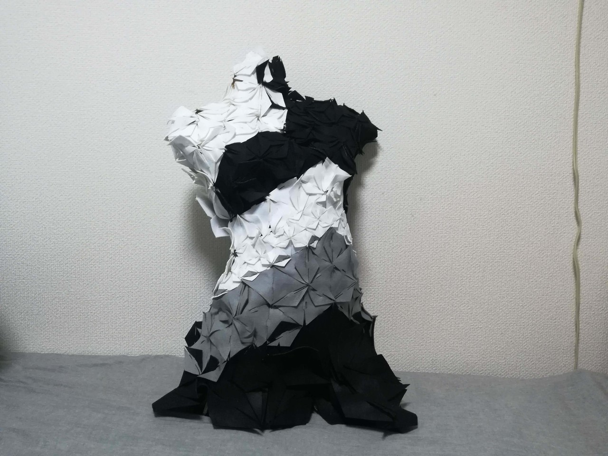
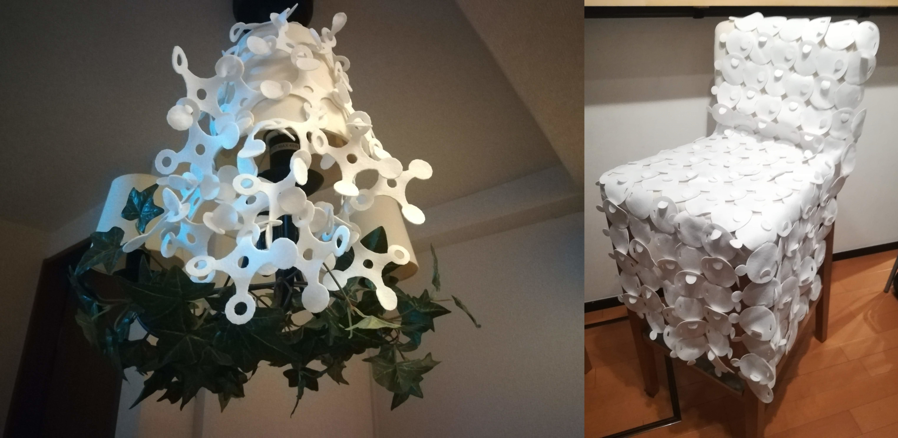
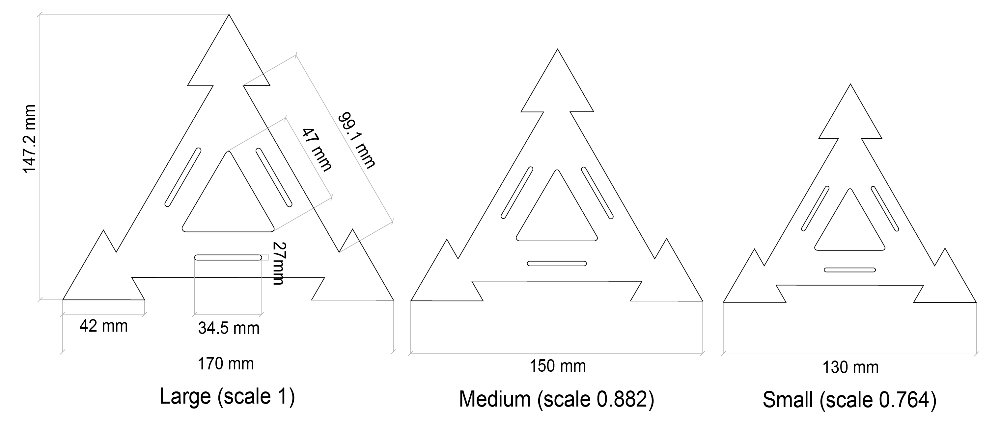
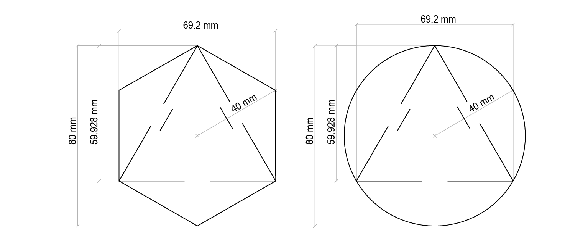
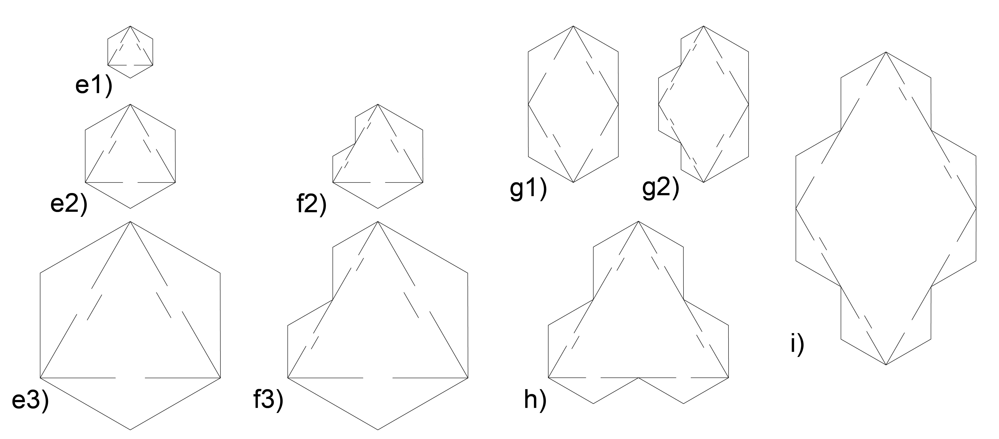
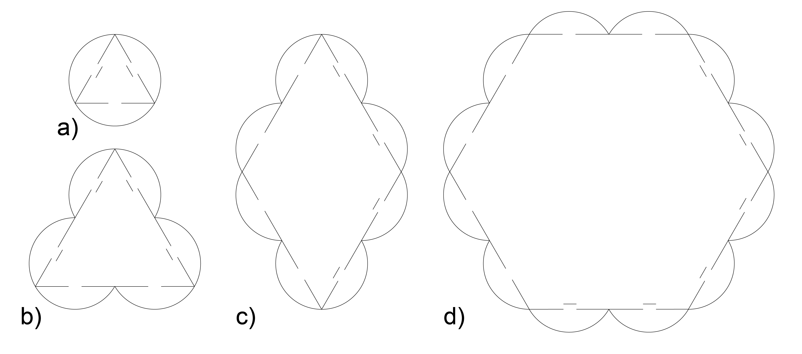
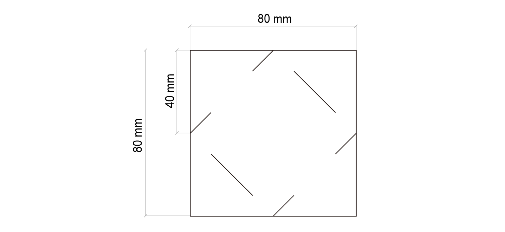
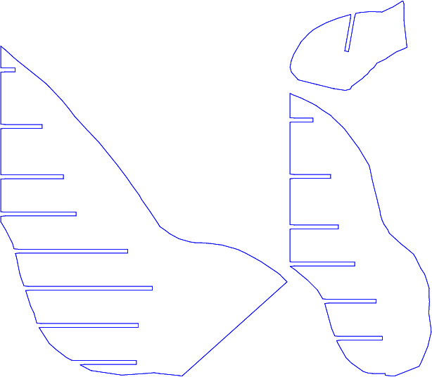
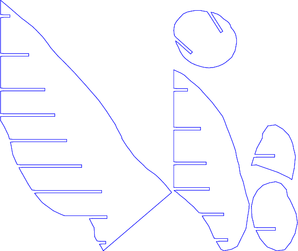

# Modules of Modular Fashion
*Read this in other languages: [English](README.en.md), [日本語](README.md)

This is modules at Modular Fashion. Modular Fashion is an approach to the production of accessories and
garments using vector graphic design of bidimensional lasercut modules.

Please check out [this Zoe's slides] (http://wiki.textile-academy.org/_media/fabricademy2017/classes/modularfashionfabricademy.pdf) at FABRICADEMY(http://textile-academy.org/) .

This repo has following modules and additional SVGs.

| Module name  | Directory name |
|-------|-------|
| Carolin module                 | Calolin/  |
| Eunsuk module                  | HybridHexagon/, HybridCircle/  |
| Fioen-Berber rectangle module  | Rect/ |
| Shape Shifters module  | ShapeShifters/ |

| Additional SVG's name  | Directory name |
|-------|-------|
| Human torso                    | HumanTorso/ |

## Carolin module
[Article about a module of Carolin](https://medium.com/@CarolinVogler/modular-fashion-c98306c820a9)

## Eunsuk module
[Public thesis about these modules by Hur ES, Thomas BG, & Beverley KJ](https://archive.bridgesmathart.org/2011/bridges2011-217.pdf)

##Fioen-Berber rectangle module
[Circular economy: modular design] (https://www.linkedin.com/pulse/circular-economy-modular-design-fioen-van-balgooi/)

## Shape Shifters module
[Article of Shape Shifters] (https://blog.lexus.co.uk/lexus-design-award-2016-angelena-laura-fenuta/)

## Cuma & Cross module
It needs to make yourself in private or buy it at [Cuma & Cross website](http://www.andoo.jp/index-4.html#panel-3). Because it has its patent.

## Human torso
[Article about how to make human torso by Carolin](https://medium.com/@CarolinVogler/fabricating-human-shapes-6854cb14aef7)

**dxf_v2-0**

**dxf_v2-1**

And more..
**dxf_v2-2**, **dxf_v2-3**, **dxf_v2-4**, **dxf_v2-5**, **dxf_v2-6**, **dxf_v2-7**, **dxf_v2-8**, **dxf_v2-9**, **dxf_v2-10**, **dxf_v2-11**, **dxf_v2-12**, **dxf_v2-13**, **dxf_v2-14**, **dxf_v2-15**

## References
[1] Zoe Roman, Fabricademy, "Modular Fashion", http://wiki.textile-academy.org/_media/fabricademy2017/classes/modularfashionfabricademy.pdf （最終アクセス 2019年3月8日）

[2] Fioen van Balgooi, "Circular economy: modular design", https://www.linkedin.com/pulse/circular-economy-modular-design-fioen-van-balgooi/ （最終アクセス 2019年3月8日）

[3] Hur ES, Thomas BG (2011) "Transformative Modular Textile Design", The Bridg 2011: Mathematical Connections between Art, Music and Science The Bridges Organization: art and mathematics.: p217-p244.

[4] Carolin Vogler, "Modular Fashion", https://medium.com/@CarolinVogler/modular-fashion-c98306c820a9 （最終アクセス 2019年3月8日）

[5] Hur ES, Beverley KJ (2013) "The role of craft in a co-design system for sustainable fashion", The Making Futures: the Crafts as Change Maker in Sustainably Aware Cultures, Proceedings: Making Futures: The Crafts in the Context of Emerging Global Sustainability Agendas Plymouth College of Art: 2.

[6] FLAVORWIRE, "Dutch Designers’ Modular “Refinity” Clothing Is Like Legos for Fashion", http://flavorwire.com/50321/dutch-designers-modular-refinity-clothing-is-like-legos-for-fashion （最終アクセス 2019年3月8日）

[7] 安藤 健浩, "フェルトユニット／CUMA", http://www.andoo.jp/index-4.html#panel-3 （最終アクセス 2019年3月8日）

[8] 安藤 健浩, "フェルトユニット／CROSS", http://www.andoo.jp/index-4.html#panel-8 （最終アクセス 2019年3月8日）

